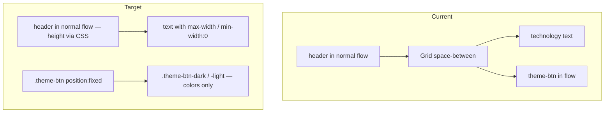

# Plan: GitHub issue #9 — fixed theme button and “AI” in header

**Specification:** [task-issue-9-dor.md](task-issue-9-dor.md)  
**Issue:** https://github.com/PavelPleshkov/todo-fullstack/issues/9

Implement in `apps/frontend` a fixed theme button (`position: fixed`), add “AI” to the technology list after “GraphQL”, and enforce required spacing without text overlap.

For post-implementation layout fixes and the final markup/CSS (after manual testing), see [As-built revisions (post–first implementation)](#as-built-revisions-post-first-implementation).

## Checklist

- [ ] Update `Header.tsx`: “, AI” text, markup with `header-tech-text`, `className` `theme-btn` + `theme-btn-{theme}`
- [ ] `globals.css`: uncomment `.theme-btn` (fixed, offsets, z-index); theme-specific `.theme-btn-*` classes only for colors; header `min-height`, `.header-tech-text`
- [ ] Update `Header.test.tsx`: AI appears after GraphQL; keep `theme-btn`/`header` testids and theme toggle test
- [ ] Run `yarn lint` (repo root) and `yarn test` (`apps/frontend`)
- [ ] Manual check: scroll, theme click, narrow viewport, 10px gaps, compare initial position
- [ ] Verify issue #9 via GitHub MCP `issue_read` before/after implementation

## Current state

- [`apps/frontend/app/components/Header.tsx`](../apps/frontend/app/components/Header.tsx): theme button inside MUI `Grid` with `justifyContent="space-between"` — in normal document flow; technology string ends at `GraphQL` (no `AI`). Commented `className` variant: `"theme-btn theme-btn-" + theme`.
- [`apps/frontend/app/globals.css`](../apps/frontend/app/globals.css): `.header-*` / `.theme-btn-*` styles are colors only; commented `.theme-btn` block with `position: fixed`, `right: 10px`, `top: 10px`.
- [`apps/frontend/app/(main)/layout.tsx`](../apps/frontend/app/(main)/layout.tsx): app shell with `<header>` in a Grid column, `overflowX: hidden` on the container — usually fine for `fixed`, but verify after changes. *(Formerly `app/page.tsx` before App Router tab migration.)*
- Tests: [`Header.test.tsx`](../apps/frontend/app/components/Header.test.tsx) cover render, text, and theme toggle; [`layout.test.tsx`](../apps/frontend/app/(main)/layout.test.tsx) clicks `theme-btn` — keep `data-testid` attributes. *(Formerly `page.test.tsx`.)*



## Target architecture

1. **Theme button** — `position: fixed` on `Button`. Shared positioning and stacking — in **`.theme-btn`** (uncomment and extend the block in `globals.css`): `right: 10px`, `top: 10px`, `z-index`; adjust `height` for MUI `Button` if needed. **`.theme-btn-dark`** / **`.theme-btn-light`** keep colors only (as today inside `.header-dark` / `.header-light`).
2. **`<header>`** — stays in normal flow, **no** `fixed`/`sticky` on the container.
3. **Header height** — `min-height` on `.header-dark` / `.header-light` (tune against current strip in DevTools, ~56–64px).
4. **Technology text** — `, AI` right after `GraphQL`; `.header-tech-text` with `min-width: 0`, `max-width: calc(100vw - 80px - 20px)`; `padding-right` on `.header-inner` reserves space for the button; ellipsis/wrap on narrow screens.
5. **Markup** — simplify `Grid`; button uses two classes: `theme-btn` + `theme-btn-{theme}`.

## Implementation steps

### 1. “AI” text

In `Header.tsx`, change the string to:

```tsx
(React, TS, Next.js, Nest.js, PostgreSQL, formik, yup, RTL, Jest, GraphQL, AI);
```

(comma and space — same as other list items).

### 2. Header markup

In `Header.tsx`:

- Wrap the technology block in a container with class `header-tech-text`.
- Add class `header-inner` on the `Grid container`.
- Button: `className={"theme-btn theme-btn-" + theme}` (instead of `theme-btn-{theme}` only), `data-testid="theme-btn"`.
- Simplify `Grid` (remove `space-between` if the button is no longer in the row flex layout).

### 3. Styles in globals.css

**Uncomment and update `.theme-btn`:**

```css
.theme-btn {
  position: fixed !important;
  right: 10px;
  top: 10px;
  z-index: 1100;
  /* height: 24px — remove or replace if MUI Button needs more height */
}
```

**Theme classes — colors only** (no duplicate `position` / `right` / `top` / `z-index`):

```css
.header-dark {
  ... .theme-btn-dark {
    background-color: var(--foreground);
    color: var(--background);
  }
}
.header-light {
  ... .theme-btn-light {
    background-color: var(--background);
    color: var(--foreground);
  }
}
```

**Additionally:**

- `.header-dark`, `.header-light` — `min-height`.
- `.header-inner` — `padding-right: calc(10px + 80px)`.
- `.header-tech-text` — `min-width: 0`, `max-width: calc(100vw - 80px - 20px)`, ellipsis/wrap as needed.

If initial placement conflicts with mandatory 10px gaps — **spacing rules from the DoR take priority**.

### 4. page.tsx — only if needed

Do **not** change `page.tsx` if header `min-height` is sufficient and `overflow-x: hidden` does not break the containing block for `fixed`.

Change **only if** manual testing shows the fixed button blocks clicks on content while scrolling — then add padding on the scrollable area without changing `<header>` positioning.

### 5. Tests

In `Header.test.tsx`:

- Text includes `GraphQL` and `AI` (order: `GraphQL` before `AI`).
- Keep `data-testid="header"`, `data-testid="theme-btn"`, theme toggle behavior.
- Optional: button has class `theme-btn` and `getComputedStyle(themeBtn).position === 'fixed'`.

`layout.test.tsx` — unchanged if `theme-btn` stays clickable. *(Formerly `page.test.tsx`; shell now lives in `app/(main)/layout.tsx`.)*

## Risks and mitigation

| Risk                                   | Mitigation                                             |
| -------------------------------------- | ------------------------------------------------------ |
| Button out of flow → shorter header    | `min-height` on `.header-*`                            |
| Draft `height: 24px` too small for MUI | Remove or replace in `.theme-btn` after DevTools check |
| Text overlap on narrow screens         | `max-width` calc, `padding-right`, ellipsis/wrap       |
| Legacy position vs `right: 10px`       | DoR spacing rules take priority                        |
| MUI overrides `position`               | `!important` on `.theme-btn`                           |
| `transform` on ancestor                | Check in DevTools; no transform in `page.tsx`          |
| Different “Light” / “Dark” widths      | 80px buffer in calc                                    |
| Button over content while scrolling    | Expected per issue; content padding only if needed     |

## Validation (DoR acceptance criteria)

### Automated

From repository root:

```bash
yarn lint
```

From `apps/frontend`:

```bash
yarn test
```

Expected: lint passes for touched files; all `Header` / `page` tests pass.

### Manual

```bash
yarn dev
```

Open `http://localhost:3000`:

1. **Before scroll:** compare button position with current main (or [issue screenshot](https://github.com/user-attachments/assets/d4b6eea1-8477-4e05-b165-e02f35d5da9e)) — no noticeable shift (except allowed adjustment for 10px gaps).
2. **Scroll:** scroll the task list — Light/Dark button stays on screen (`position: fixed`).
3. **Text:** header shows `... GraphQL, AI`.
4. **Click:** theme toggle works.
5. **Narrow viewport** (DevTools responsive, e.g. 320–400px): no overlap between text and button; text↔button gap ≥ 10px; button↔viewport right edge = 10px.
6. **Resize:** narrow/widen window — gap rules hold.
7. **Header height:** content below header does not jump vs main.

### GitHub MCP (course requirement)

Before/after work: use approved GitHub MCP (`issue_read`) to verify issue #9 — issue body and any new comments affecting scope.

## Boundaries (do not change)

- `apps/backend`, `packages/*`, `apps/docs` — out of scope.
- `ThemeContext.tsx` — unchanged unless theme behavior breaks.
- Do not use `position: absolute` / `sticky` for the theme button.
- Do not make `<header>` fixed/sticky.

## PR / commit order

1. CSS (`.theme-btn` + header constraints) + Header markup (`AI`, button classes).
2. Tests.
3. Brief PR note if initial placement shifts slightly to satisfy mandatory 10px gaps.

## As-built revisions (post–first implementation)

_The sections above describe the approved plan before Build. After the first implementation pass, manual testing on a narrow viewport showed overlap between the fixed theme button and the technology text, weak vertical alignment, and padding conflicts. The items below record the **final** approach. Requirements in [task-issue-9-dor.md](task-issue-9-dor.md) are unchanged; only implementation details differ from the original plan steps._

### What stayed as planned

- Theme button: `position: fixed`, `right: 10px`, `top: 10px`, `z-index: 1100` on `.theme-btn`; colors on `.theme-btn-dark` / `.theme-btn-light` only.
- Text `GraphQL, AI` in the header technology list.
- `<header>` remains in normal document flow (not `fixed` / `sticky`).
- `page.tsx` unchanged.
- `data-testid="header"` and `data-testid="theme-btn"` preserved.

### Markup and class names (differs from original plan)

| Original plan                                         | Final implementation                                                                                          |
| ----------------------------------------------------- | ------------------------------------------------------------------------------------------------------------- |
| MUI `Grid` with `padding` / `space-between`           | `div` with `className="header-inner"`                                                                         |
| `.header-tech-text`                                   | `.header-title-text` inside `.header-title-wrapper`                                                           |
| Theme layout only on `.header-dark` / `.header-light` | Shared **`.header`** for layout; **`.header-dark` / `.header-light`** for colors and button theme styles only |
| —                                                     | `<header className="header header-{theme}">`                                                                  |
| —                                                     | Structure: `header-title` → `header-title-wrapper` → `header-title-icon` + `header-title-text`                |

**Icon + text:** `.header-title-wrapper` uses `display: flex`, `flex-wrap: nowrap`, and `gap: 16px` so the star icon stays at the start of the line and the technology text wraps **beside** the icon, not on a new row under it.

**No spacer element** in the DOM (explicitly rejected during review); space for the fixed button is reserved with CSS padding only.

### CSS changes vs original plan

| Original plan                                    | Final implementation                                                                                                                                                              |
| ------------------------------------------------ | --------------------------------------------------------------------------------------------------------------------------------------------------------------------------------- |
| `max-width: calc(100vw - 80px - 20px)` on text   | `max-width: 100%` inside a flex chain (`min-width: 0` on `.header-inner`, `.header-title`, `.header-title-text`)                                                                  |
| `padding-right: calc(10px + 80px)`               | `--header-btn-zone: 90px` on `.header`; `padding-right: calc(var(--header-padding) + var(--header-btn-zone))` on `.header-inner` (100px total right inset with 10px base padding) |
| `min-height` on `.header-dark` / `.header-light` | `min-height: 56px` on **`.header`**                                                                                                                                               |
| Padding via MUI `Grid` `padding="10px"`          | Single source: `.header-inner` padding in CSS (`--header-padding: 10px`) — avoids MUI overriding `padding-right`                                                                  |

### Tests

- `Header.test.tsx`: asserts `header` + `header-dark`, `GraphQL, AI` order via `.header-title-text`, `theme-btn` classes, theme toggle.
- No `getComputedStyle(...).position === 'fixed'` in Jest (jsdom does not reliably apply global CSS); fixed behavior verified manually (DoR AC 1, 5).

### Validation notes

- **Passed (feature scope):** `yarn test app/components/Header.test.tsx` (5/5), ESLint on touched TS files, `yarn build` in `apps/frontend`.
- **Understood failures (out of scope #9):** full `yarn test` (Apollo provider missing in several suites), full `yarn lint` (`Tasks.tsx` `setState`-in-effect).
- **Manual:** scroll keeps button fixed; theme toggle; narrow viewport without text/button overlap; ≥10px text↔button and 10px button↔viewport right edge per DoR; layout acceptable after `--header-btn-zone: 90px`.

### PR / review hint

If the PR description references this plan, link this section for reviewers so they do not follow superseded steps (e.g. `header-tech-text`, `80px` zone, `calc(100vw …)`).
